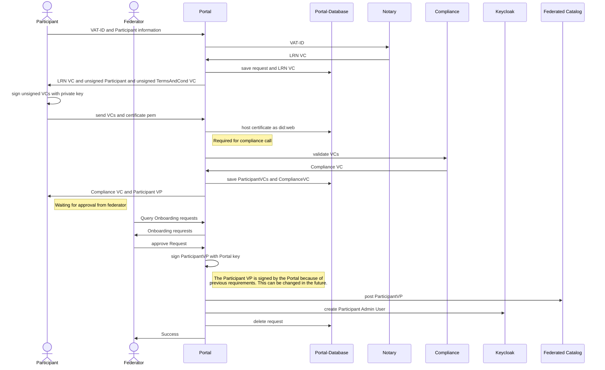
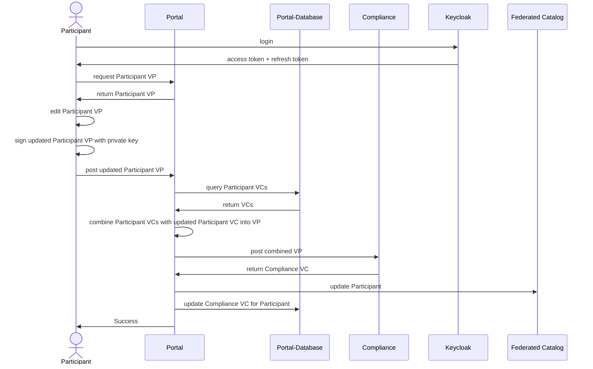
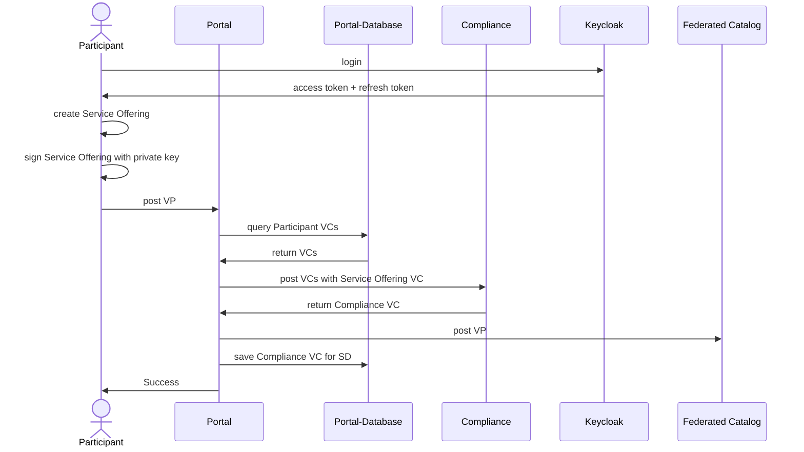
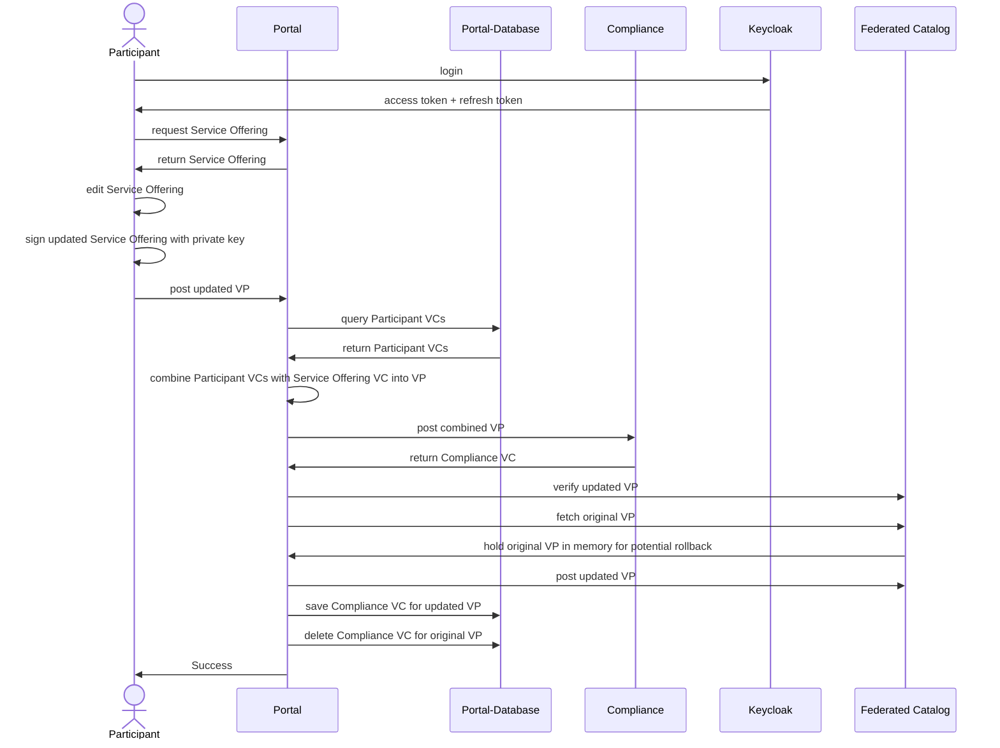

# Health-X Portal

The Health-X Portal provides an UI to interact the Federated Catalog with some additional features like hosting DIDs and holding compliance VCs for self descriptions.

The Portal/Federated Catalog enable management of participants, service offerings and users in the dataspace.

## Participants

### Participant onboarding

To participate in a dataspace a Participant has to go through the following onboarding process:

### Update Participant

## Service Offerings

### Add Service Offering

### Update Service Offering

## Users

The portal provides a UI that directly reflects the user API of the Federated Catalog.

Each user is assigned to a role granting them specific access e.g. a user created via the onboarding process is a participant administrator. Further documentation can be found in the [Federated Catalog documentation](https://gaia-x.gitlab.io/data-infrastructure-federation-services/cat/architecture-document/architecture/catalogue-architecture.html#_authorization).
